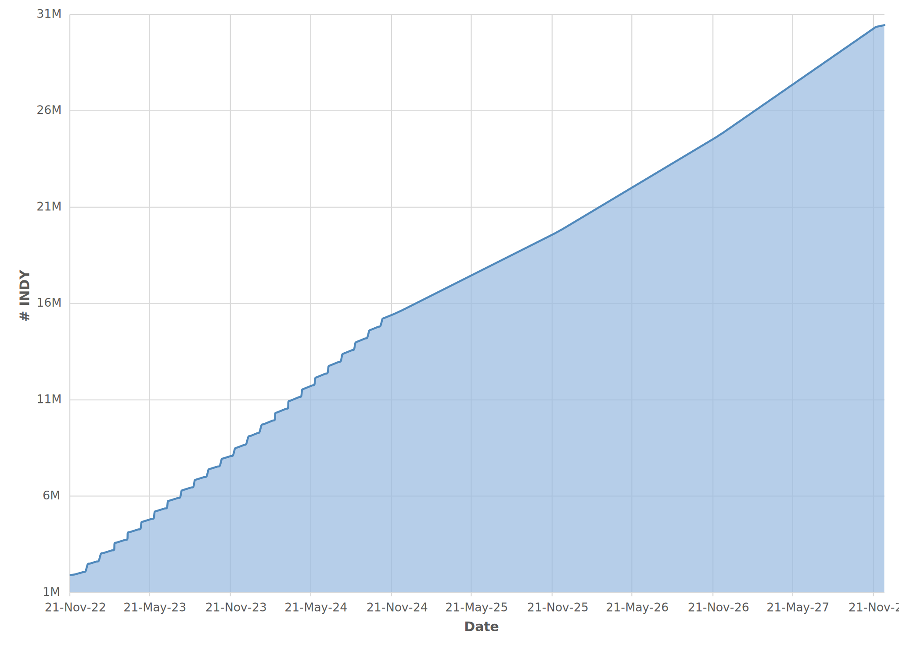

# Indigo Tokenomics

A tool for illustrating Indigo’s tokenomics.

The Indigo Protocol is managed by the Indigo DAO. The Indigo DAO is
managed by DAO Members and the Indigo Foundation administers the votes
of the DAO Members. To become a DAO Member, one must stake Indigo’s
utility token (INDY) within the protocol.

INDY is a Cardano native token with a fixed supply of 35M. As an owner
of INDY, you can stake and unlock two benefits:

1.  The right to create and vote on governance proposals
2.  Receiving a proportional share of Indigo Protocol’s fees

# INDY Distribution by Category

| **Use**                      | **%** |     **\#** |
| :--------------------------- | ----: | ---------: |
| **Airdrop**                  |     1 |    350,000 |
| **Team**                     |    25 |  8,750,000 |
| **DAO Controlled Tokens**    | **-** |      **-** |
| **DAO Treasury**             |    13 |  4,550,000 |
| **Governance Participation** |     5 |  1,750,000 |
| **iAsset Liquidity Staking** |    15 |  5,250,000 |
| **Protocol Owned Liquidity** |     1 |    350,000 |
| **Stability Pool Rewards**   |    40 | 14,000,000 |

## Airdrop

Two airdrops will be conducted for Indigo:

1.  Discord Airdrop
2.  Staking Airdrop

Both airdrops are allocated 175,000 INDY each. For the first airdrop,
INDY is to be distributed to a pre-selected list of Indigo Discord
members. For the second airdrop, INDY is to be distributed to delegators
of pools part of the [Cardano Single Pool
Alliance](https://singlepoolalliance.net/).

## Team Vesting

Upon deployment of Indigo mainnet, 875,000 INDY was distributed to an
unlocked wallet owned by Indigo Laboratories, Inc. Another 7,875,000
INDY was distributed to a wallet owned by Indigo Laboratories, Inc.
subject to a per-month vesting schedule.

# DAO Controlled Tokens

## DAO Treasury Reserve

The DAO Treasury holds funds within a smart contract that can be
accessed upon a protocol upgrade approved by DAO Members. INDY held
within the Treasury is locked and prohibited from being part of
circulating supply until Governance Proposals authorize funds to be
unlocked. 5,425,000 is distributed to the Treasury upon launch of Indigo
mainnet.

## Governance Participation Allocation

INDY is unlocked every epoch (beginning three epochs after launch) and
dis- tributed to DAO Members who participate in the decentralized
governance of the Indigo DAO. 1,750,000 is distributed over a 5-year
period shortly following the launch of Indigo mainnet.

## iAsset Liquidity Staking Allocation

INDY is unlocked every epoch (beginning six epochs after launch) and
distributed to users who participate in providing iAsset liquidity.
5,250,000 is distributed over a 5-year period shortly following the
launch of Indigo mainnet.

## Protocol Owned Liquidity Allocation

The Indigo DAO holds DEX Liquidity Provider (LP) tokens in the on-chain
DAO Treasury. These LP tokens will 350,000 INDY worth of liquidity for
the token, minus any fees charged by DEXs.

## Stability Pool Rewards Allocation

INDY is unlocked every epoch (beginning two epochs after launch) and
dis- tributed to users who participate in providing staking iAssets in
Indigo’s Stability Pools. 14,000,000 is distributed over a 5-year period
shortly following the launch of Indigo mainnet.

# Token Generation Event

The Token Generation Event (TGE) occurs on the day of mainnet
deployment. After INDY is minted, it is to be allocated as follows:

  - 350,000 INDY to two or three DEXs approved by the Indigo community
  - 350,000 INDY to participants within the Indigo community
  - 21,000,000 INDY to one or more wallets (administrated by Indigo
    Laboratories, Inc. at the direction of the Indigo Foundation on
    behalf of the Indigo DAO) to be used for the sole purpose of
    community rewards distributions (Stability Pools, Liquidity, and
    Governance)
  - 4,550,000 INDY to the DAO Treasury Reserve
  - 8,750,000 INDY will be allocated to Indigo Laboratories, Inc. for
    past and expected future building, administering, and further
    developing the protocol, with 7,875,000 being distributed to team
    members under a two-year monthly vesting schedule

Periodically, INDY tokens are unlocked from their vesting schedule and
released into the circulating supply. A full table of the INDY
distribution schedule can be seen in
[tokenomics.csv](spreadsheets/tokenomics.csv).

## Installation

The indy-tokenomics (`indy`) tool is a CLI app written in Python3. It’s
installable via pip. It’s recommended to install inside a virtual
environment. Create a virtual environment using venv:

    python3 -m venv venv

Activate the virtual environment. In Linux:

    source venv/bin/activate

In Windows:

    .\venv\Scripts\activate

After the virtual environment is activated, install the pip:

    pip install -e .

## Usage

After installation, the tool will be available via the `indy` command.
Running the `--help` option will show all the available commands for the
tool.

    $ indy --help
    Usage: indy [OPTIONS] COMMAND [ARGS]...
    
      An interface for illustrating Indigo’s tokenomics.
    
    Options:
      --help  Show this message and exit.

### Governance

Indigo is completely decentralized and controlled by owners of INDY. Any
owner of INDY can submit Governance Proposals that can then be voted on
by DAO Members. To determine if a Governance Proposal passes or fails,
Indigo uses Adaptive Quorum Biasing (AQB). Quorum threshold adjusts
dynamically based on how much participation a Proposal receives. The
less people who vote, the higher the proportion of “yes” votes required
for a Proposal to be passed. If there’s a large amount of participation,
then the threshold is reduced. The threshold is always at least 50%,
meaning that the majority must vote “yes” for a Proposal to pass.

`indy` offers a `aqb vy` command to show how many “yes” votes are
required:

    $ indy vy --help
    Usage: indy vy [OPTIONS] VN E
    
      Calculates how many yes votes are required for a proposal to pass AQB.

`indy vy` takes two variables: the number of current “no” votes, and the
electorate. The electorate is the current circulating supply of INDY,
which can be calculated using the `indy total` command.

To determine if a Governance Proposal passed, the `aqb proposal` command
can be run:

    $ indy aqb proposal --help
    Usage: indy aqb proposal [OPTIONS] VY VN E
    
      Evaluates whether a proposal has passed AQB.

`indy aqb proposal` takes three variables: the number of “yes” votes,
the number of “no” votes and the electorate, also known as the INDY
circulating supply.

### INDY Circulating Supply

To find out what the current circulating supply is, run `indy total`.
Alternatively, to see what the circulating supply would be on a
particular date, pass in a date (e.g. `2022-12-03`) via the `--date`
option.

## Development

This project makes use of Python tools to enforce coding standards and
validate accuracy. To install the Python development tools, run:

    pip install -r requirements-dev.txt

This project also makes use of git pre-commit hooks. To set up the
hooks, ensure you have `git` and `pre-commit` installed then run:

    pre-commit install

You can verify if the git hook is working properly by running:

    pre-commit run --all-files

Before code is committed to this repository it must pass automated
checks for code conformity. The git hook will automatically refactor
code to ensure compliance.

### Testing

Tests run upon creation of GitHub pull requests and can be run locally
using `pytest`:

    pytest .
